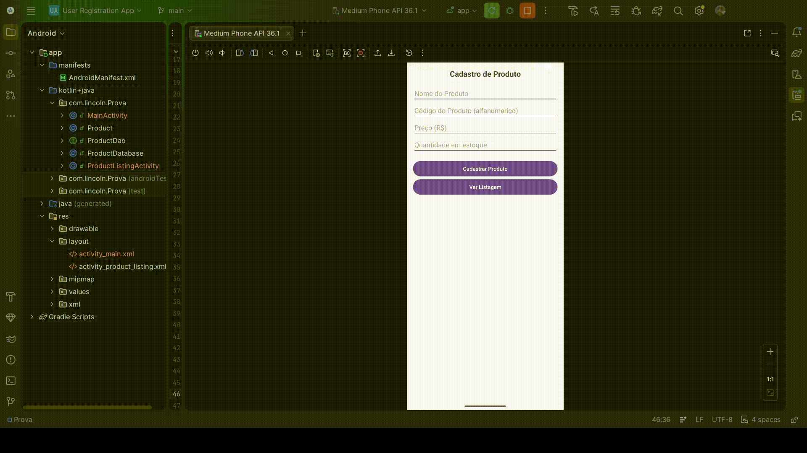

# 📦 App de Cadastro de Produtos

Este projeto é um aplicativo Android desenvolvido em Java que utiliza a biblioteca **Room Database** para persistência local de dados. O objetivo principal é permitir o cadastro e a visualização de produtos com validações específicas.

## 🚀 Objetivo

Desenvolver um aplicativo funcional com ao menos duas telas:
1. **Tela de Cadastro**: Onde o usuário insere os dados do produto.
2. **Tela de Listagem**: Onde o usuário visualiza os produtos cadastrados no banco de dados.

## 📌 Funcionalidades Obrigatórias

### Cadastro de Produto
Permite inserir os seguintes campos:
- **Nome do produto**: Texto obrigatório.
- **Código do produto**: Alfanumérico obrigatório.
- **Preço (R$)**: Apenas números positivos com até duas casas decimais.
- **Quantidade em estoque**: Apenas números inteiros positivos.

### Validações
- Todos os campos são de preenchimento obrigatório.
- O sistema impede a inserção de valores negativos ou formatos inválidos nos campos numéricos.

### Armazenamento Local (Room)
- **Entidade `Product`**: Define a estrutura da tabela no SQLite.
- **Interface `ProductDao`**: Contém os métodos de inserção (`insert`) e listagem (`getAllProducts`).
- **Banco de Dados `ProductDatabase`**: Implementação central do Room seguindo o padrão Singleton.

### Listagem de Produtos
- Apresenta o Nome, Código e Preço de cada item cadastrado.
- Botão de navegação para retornar à tela de cadastro.

## 📂 Estrutura de Arquivos Principal

- `MainActivity.java`: Lógica da tela de cadastro e validações.
- `ProductListingActivity.java`: Lógica da tela de exibição dos dados.
- `Product.java`: Classe de entidade do Room.
- `ProductDao.java`: Interface de acesso aos dados.
- `ProductDatabase.java`: Classe abstrata para gerenciamento do banco.
- `activity_main.xml`: Layout da tela de cadastro.
- `activity_product_listing.xml`: Layout da tela de listagem.

## 💻 Tecnologias Utilizadas

- **Linguagem**: Java
- **Banco de Dados**: Room Database
- **IDE**: Android Studio
- **Versão do SDK**: Target 36 / Min 25

## 🛠️ Como Executar

1. Importe o projeto no **Android Studio**.
2. Aguarde a sincronização do Gradle.
3. Execute em um emulador ou dispositivo físico com Android 7.1 (API 25) ou superior.

---
## 👥 Autor

Desenvolvido por **Lincoln Alves de Oliveira**.

